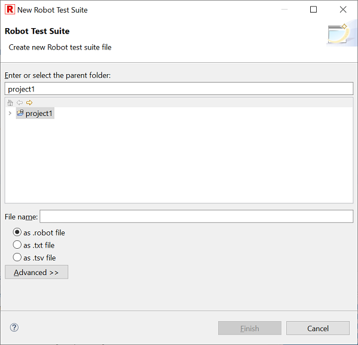
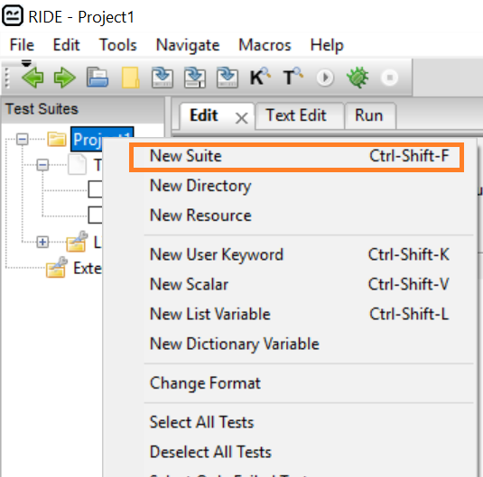
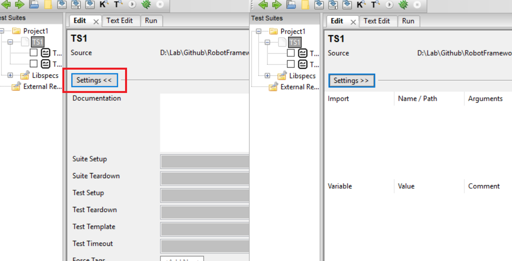
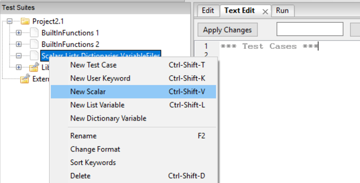
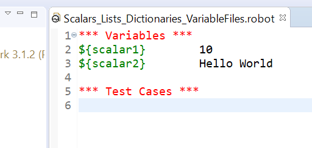
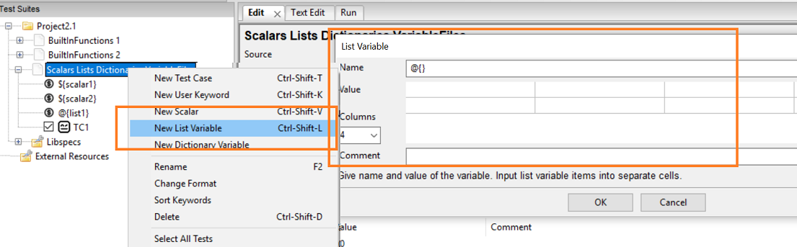
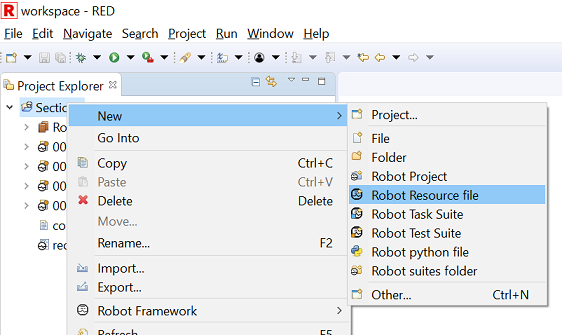

## Section 2


### Lecture 2.1 - Test Suite, Test Cases, User Keywords and Reports

**Test Suite** - As explained in L-1.5, we can create a **Test Suite** under a project. A *test suite*, in general, is a collection of test cases.

A test suite can be saved as .robot file, .txt file or .tsv file. You can follow any one and use it across in your project.



In RIDE, it appears like this




**Test Suite Configuration**

1. Imports
	a. Libraries
	b. Resources
	c. Variables
	
2. Add new
	a. Scalar
	b. List
	c. Dictionary
	d. Metadata
	
3. Settings
	a. Documentation
	b. Suite Setup
	c. Suite Teardown
	d. Test Setup
	e. Test Teardown
	f. Test Template
	g. Test Timeout
	h. Force Tags
	i. Default Tags

Configuring these on RIDE is very easy because its interface is very user friendly.




In RED, you need to go to editor and click Ctrl + Space. When you double click on Settings, all these would pop up.


We will see more details about these later.


**Test Cases** - 

It is absolutely okay, if you do not understand the below code and it's output. Just have a glimpse of how we write test cases in robot framework.

```
*** Test Cases ***

TestCase1 - Celcius to Farenheit
    ${celcius}=    Set Variable    37
    ${Farehneit}=    Evaluate    (${celcius}*9/5)+32
    Log    ${Farehneit}
    
TestCase2 - Celcius to Farenheit in Bulk
    @{celcius}=    Create List    10    12    37    22
    FOR    ${temp}    IN    @{celcius}
        ${Farehneit}=    Evaluate    (${temp}*9/5)+32
        Log    ${Farehneit}
    END
```

### Output logs
```
Starting test: Project1.TS1.TestCase1 - Celcius to Farenheit
20191207 22:41:50.743 : INFO : ${celcius} = 37
20191207 22:41:50.743 : INFO : ${Farehneit} = 98.6
20191207 22:41:50.743 : INFO : 98.6
Ending test: Project1.TS1.TestCase1 - Celcius to Farenheit

Starting test: Project1.TS1.TestCase2 - Celcius to Farenheit in Bulk
20191207 22:41:50.743 : INFO : @{celcius} = [ 10 | 12 | 37 | 22 ]
20191207 22:41:50.743 : INFO : ${Farehneit} = 50.0
20191207 22:41:50.743 : INFO : 50.0
20191207 22:41:50.743 : INFO : ${Farehneit} = 53.6
20191207 22:41:50.743 : INFO : 53.6
20191207 22:41:50.743 : INFO : ${Farehneit} = 98.6
20191207 22:41:50.743 : INFO : 98.6
20191207 22:41:50.743 : INFO : ${Farehneit} = 71.6
20191207 22:41:50.743 : INFO : 71.6
Ending test: Project1.TS1.TestCase2 - Celcius to Farenheit in Bulk
```


**User Keywords** -

User keywords are nothing but Functions if we compare with programming languages. We use functions to make code modular. In the same way, User keywords in robot framework are meant to serve this purpose.

```
*** Test Cases ***
TC1
    Function1
    Run Keyword    Function2    

*** Keywords ***
Function1
    Log    This is a inner function1
    
Function2
    Log    This is a inner function2
```
---------------------------------------------------------------


### Lecture 2.2 - Builtin-Library and keywords

**Local and Global Variables**

**1. Set Variable**
```
TC1
	${a}=    Set Variable    50
```

**2. Set Variable If**
```
TC2
	${a}=    Set Variable If    True==True    50    100
	Log    ${a}
TC3
	${a}=    Set Variable If    True==False    50    100
	Log    ${a}
```

**Output:**
```
20191208 23:18:11.433 : INFO : ${a} = 50
20191208 23:18:11.434 : INFO : 50
Ending test: Project1.TS1.TC2

Starting test: Project1.TS1.TC3
20191208 23:18:11.436 : INFO : ${a} = 100
20191208 23:18:11.438 : INFO : 100
```


**3. Set Global Variable**
```
TC4 - Set Global Variable
	${a}=    Set Variable    50
	Set Global Variable    ${a}
```
Now variable a is global and can be used from anywhere throughout the execution.


**Data type/Number system Conversion**
	
**4. Convert To Binary**
```
TC5 - Convert To Binary
	${a}=    Set Variable    99
	${b}=    Convert To Binary    ${a}
	Log    ${b}
```

**Output:**
```
Starting test: Section2.BuiltInFunctions.TC5 - Convert To Binary
20191212 11:48:08.040 : INFO : ${a} = 99
20191212 11:48:08.041 : INFO : ${b} = 1100011
20191212 11:48:08.042 : INFO : 1100011
```

**5. Convert To Boolean**

This function is use to handle case-sensitive true and false and conver to a boolean value.
```
TC6 - Convert To Boolean
    ${a}=    Set Variable    tRuE
    ${b}=    Convert To Boolean    ${a}
    Log    ${b}
```

```
Starting test: Section2.BuiltInFunctions.TC6 - Convert To Boolean
20191212 11:54:59.294 : INFO : ${a} = tRuE
20191212 11:54:59.294 : INFO : ${b} = True
20191212 11:54:59.295 : INFO : True
```

**6. Convert To Bytes**
```
TC7 - Convert To Bytes
    ${b}=    Convert To Bytes    75 65 77 65 76     int
    Log    ${b}
```

**Output:**
```
20191212 12:10:24.323 : INFO : ${b} = KAMAL
20191212 12:10:24.324 : INFO : KAMAL
```

**7. Convert To Hex**
```
TC8 - Convert To Hex
	${b}=    Convert To Hex    100    10
	${b}=    Convert To Hex    100    8
```    


**Output:**
```
20191212 12:14:56.941 : INFO : ${b} = 64
20191212 12:14:56.941 : INFO : ${b} = 40
```

**8. Convert To Integer**
```
TC9 - Convert To Integer
    ${b}=    Convert To Integer    FF    16
	${b}=    Convert To Integer   100    8
```

**Output:**
```
20191212 12:16:10.501 : INFO : ${b} = 255
```

**9. Convert To Number**
```
TC10 - Convert To Number
    ${b}=    Convert To Number    41.111    1
```

**Output:**
```
20191212 13:09:03.088 : INFO : ${b} = 41.1
```

**10. Convert To Octal**
```
TC11 - Convert To Octal
    ${b}=    Convert To Octal    111    2
```

**Output:**
```
20191212 13:10:54.408 : INFO : ${b} = 7
```


**11. Set Log Level**
```
TC13 - Info Logs
    Set Log Level    INFO
    Log    this is Info Log    INFO
    Log    <h1>this is HTML Log</h1>    HTML
    Log    this is WARN Log    WARN
    Log    this is ERROR Log    ERROR
    Log    this is DEBUG Log    DEBUG

TC14 - Debug and Trace Logs
    Set Log Level    DEBUG
    ${a}=    Set Variable    100
```

By default only Info logs are printed on console. To print debug Logs, we need to set Log level to DEBUG. For trace level logs, we need to set it to TRACE.


There are lot of other functions in the built-in library. We will see their usage later while writing actual tests.

**13.Suite/Test information functions**
```
Set Suite Documentation
Set Suite Metadata
Set Suite Variable
Set Tags
Set Test Documentation
Set Test Message
```

**14. Logs & Comments functions**
```
Comment
Log
Log Many
Log To Console
Log Variables
```

**15. Assertion functions**
```
Length Should Be
Should Be Empty
Should Be Equal
Should Be Equal As Integers
Should Be Equal As Numbers
Should Be Equal As Strings
Should Be True
Should Contain
Should Contain Any
Should Contain X Times
Should End With
Should Match
Should Match Regexp
Should Not Be Empty
Should Not Be Equal
Should Not Be Equal As Integers
Should Not Be Equal As Numbers
Should Not Be Equal As Strings
Should Not Be True
Should Not Contain
Should Not Contain Any
Should Not End With
Should Not Match
Should Not Match Regexp
Should Not Start With
Should Start With
Variable Should Exist
Variable Should Not Exist
```


**16. Loop functions**
```
Continue For Loop
Continue For Loop If
Exit For Loop
Exit For Loop If
```

**17. Import functions**
```
Import Library
Import Resource
Import Variables
```

**18. Execution control keywords**
```
Call Method
Keyword Should Exist
Return From Keyword
Return From Keyword If
Run Keyword
Run Keyword And Continue On Failure
Run Keyword And Expect Error
Run Keyword And Ignore Error
Run Keyword And Return
Run Keyword And Return If
Run Keyword And Return Status
Run Keyword If
Run Keyword If All Critical Tests Passed
Run Keyword If All Tests Passed
Run Keyword If Any Critical Tests Failed
Run Keyword If Any Tests Failed
Run Keyword If Test Failed
Run Keyword If Test Passed
Run Keyword If Timeout Occurred
Run Keyword Unless
Run Keywords
Repeat Keyword
Wait Until Keyword Succeeds
Sleep
```

**19. Other Important functions**
```
Get Count
Get Length
Get Time
Get Variable Value
Get Variables
Catenate
Evaluate
Fail
No Operation
Pass Execution
Pass Execution If
Fatal Error
Regexp Escape
Remove Tags
Set Variable
```

---------------------------------------------------------------


### Lecture 2.3 - Scalars, Lists, Dictionaries and Variable files

**Scalars**

Adding scalar in RIDE table view looks like this.



And you can add scalar in RED in this way.



```
*** Variables ***
${scalar1}        10
${scalar2}        Hello World

*** Test Cases ***
TC1 - Use Scalars
    ${sum}=    Evaluate    ${scalar1}+100
```

**Output**
```
20191212 19:15:04.678 : INFO : ${sum} = 110
```


**Lists**



```
*** Variables ***
@{list1}          Sun    Mon    Tue    Wed    Thu    Fri    Sat

*** Test Cases ***
TC1
    Log    ${list1[3]}
```

**Output**
```
20191212 22:31:35.738 : INFO : Wed
```


**Dictionaries**
```
*** Variables ***
&{dict1}          jan=1    feb=2    mar=3    apr=4    may=5    jun=6

*** Test Cases ***
TC1
    Log    ${dict1['mar']}
```

**Output**
```
20191212 22:42:08.167 : INFO : 3
```


To create scalars, lists and dictionaries, we can also use keywords:
```
Set Variable
Set Variable If
Set Global Variable
Set Test Variable
Create List
Create Dictionary
```

```
*** Test Cases ***
TC1
    @{list2}=    Create List    1    2    3    4
    Log    ${list2[2]}    


TC2
    &{dict2}=    Create Dictionary    a=1    b=2    c=3    d=4
    Log    ${dict2['c']}    
```


**Variable Files**
```
*** Settings ***
Variables         config.py

TC3
    Log    ${firstname}${space}${lastname}
```

where config file (config.py) has

```
firstname="Kamal"
lastname="Girdher"
profile="trainer"
```

**Output**
```
20191212 22:54:05.123 : INFO : Kamal Girdher
```

---------------------------------------------------------------


### Lecture 2.4 - Suite/Test setup teardown

```
*** Settings ***
Suite Setup       suite_setup
Suite Teardown    suite_teardown
Test Setup        test_setup
Test Teardown     test_teardown

*** Test Cases ***
TC1
    Log    1

TC2
    Log    2

TC3
    Log    3

*** Keywords ***
suite_setup
    Log    SETUP SUITE

suite_teardown
    LOG    SUITE ENDS

test_setup
    LOG    TEST START

test_teardown
    Log    TEST ENDS

```


**Output**

```
20191212 23:04:51.049 : INFO : SETUP SUITE

Starting test: Project2.1.SetupAndTeardown.TC1
20191212 23:04:51.052 : INFO : TEST START
20191212 23:04:51.055 : INFO : 1
20191212 23:04:51.056 : INFO : TEST ENDS
Ending test: Project2.1.SetupAndTeardown.TC1

Starting test: Project2.1.SetupAndTeardown.TC2
20191212 23:04:51.059 : INFO : TEST START
20191212 23:04:51.060 : INFO : 2
20191212 23:04:51.061 : INFO : TEST ENDS
Ending test: Project2.1.SetupAndTeardown.TC2

Starting test: Project2.1.SetupAndTeardown.TC3
20191212 23:04:51.063 : INFO : TEST START
20191212 23:04:51.064 : INFO : 3
20191212 23:04:51.066 : INFO : TEST ENDS
Ending test: Project2.1.SetupAndTeardown.TC3

20191212 23:04:51.067 : INFO : SUITE ENDS
```

---------------------------------------------------------------


### Lecture 2.5 - External resources



Adding a resource file is very easy. It can be done by right clicking on the project and select New > Robot Resource file in RED. And in RIDE simply by clicking New Resource.

A resource is more or less similar to a test suite. The only difference is that we do not write test cases in Resource files. However, we write reusable functions(called User Keywords) and we define scalars, lists and dictionaries specific to that resource.

In Project 2.1, resource1.robot is a Resource which is imported in test suite 005_SuiteImportingResource.robot

**resource1.robot**
```
*** Keywords ***
UserKeyword1
    Log    This is keyword 1

UserKeyword2
    Log    This is keyword 2
```

We can run the keywords of resource file by directly using the keyword name or by using another built-in keyword "Run Keyword".

**005_SuiteImportingResource.robot**
```
*** Settings ***
Resource          resource1.robot

*** Test Cases ***
TC1
    Run Keyword    UserKeyword1
    UserKeyword1
```

**Output**
```
Starting test: Project2.1.005 SuiteImportingResource.TC1
20191213 10:13:04.779 : INFO : This is keyword 1
20191213 10:13:04.780 : INFO : This is keyword 1
Ending test: Project2.1.005 SuiteImportingResource.TC1
```

We have used built-in function "Run Keyword" to run our user defined keyword. Let's go back to section 2.2, point #18 "Execution control functions"
```
Call Method
Keyword Should Exist
Return From Keyword
Return From Keyword If
Run Keyword
Run Keyword And Continue On Failure
Run Keyword And Expect Error
Run Keyword And Ignore Error
Run Keyword And Return
Run Keyword And Return If
Run Keyword And Return Status
Run Keyword If
Run Keyword If All Critical Tests Passed
Run Keyword If All Tests Passed
Run Keyword If Any Critical Tests Failed
Run Keyword If Any Tests Failed
Run Keyword If Test Failed
Run Keyword If Test Passed
Run Keyword If Timeout Occurred
Run Keyword Unless
Run Keywords
Repeat Keyword
Wait Until Keyword Succeeds
Sleep
```

Now you can easily see that we can use many of these functions in different ways. You can explore these. We will cover more from the list in our next sections.


---------------------------------------------------------------


### Lecture 2.6 - Loop Statements

**Test**
```
TC1 - For loop using range
    :FOR    ${i}    IN RANGE    1    10
    \    Log    ${i}   
```

**Output**
```
Starting test: Project2.1.006 LoopStatements.TC1 - For loop using range
20191213 11:22:26.610 : INFO : 1
20191213 11:22:26.611 : INFO : 2
20191213 11:22:26.612 : INFO : 3
20191213 11:22:26.613 : INFO : 4
20191213 11:22:26.614 : INFO : 5
20191213 11:22:26.614 : INFO : 6
20191213 11:22:26.615 : INFO : 7
20191213 11:22:26.616 : INFO : 8
20191213 11:22:26.617 : INFO : 9
Ending test: Project2.1.006 LoopStatements.TC1 - For loop using range
```

**Test**
```
TC2 - For loop using range - with correct upper bound
    :FOR    ${i}    IN RANGE    1    11
    \    Log    ${i}

```

**Output**
```
Starting test: Project2.1.006 LoopStatements.TC2 - For loop using range - with correct upper bound
20191213 11:22:26.619 : INFO : 1
20191213 11:22:26.620 : INFO : 2
20191213 11:22:26.621 : INFO : 3
20191213 11:22:26.623 : INFO : 4
20191213 11:22:26.623 : INFO : 5
20191213 11:22:26.624 : INFO : 6
20191213 11:22:26.625 : INFO : 7
20191213 11:22:26.625 : INFO : 8
20191213 11:22:26.626 : INFO : 9
20191213 11:22:26.628 : INFO : 10
Ending test: Project2.1.006 LoopStatements.TC2 - For loop using range - with correct upper bound
```

**Test**
```
TC3 - For loop using a list
    @{a}=    Create List    1    2    3    4    5
    :FOR    ${i}    IN    @{a}
    \    Log    ${i}
```

**Output**
```
Starting test: Project2.1.006 LoopStatements.TC3 - For loop using a list
20191213 11:22:26.630 : INFO : @{a} = [ 1 | 2 | 3 | 4 | 5 ]
20191213 11:22:26.630 : INFO : 1
20191213 11:22:26.631 : INFO : 2
20191213 11:22:26.632 : INFO : 3
20191213 11:22:26.633 : INFO : 4
20191213 11:22:26.634 : INFO : 5
Ending test: Project2.1.006 LoopStatements.TC3 - For loop using a list
```

**Test**
```
TC4 - Exit for loop in between
    @{a}=    Create List    1    2    3    4    5
    :FOR    ${i}    IN    @{a}
    \    Log    ${i}
    \    Exit For Loop

TC5 - Conditional Exit from For Loop
    @{a}=    Create List    1    2    3    4    5
    :FOR    ${i}    IN    @{a}
    \    Exit For Loop If    ${i}>3
    \    Log    ${i}
```

**Output**
```
Starting test: Project2.1.006 LoopStatements.TC4 - Exit for loop in between
20191213 11:22:26.635 : INFO : @{a} = [ 1 | 2 | 3 | 4 | 5 ]
20191213 11:22:26.636 : INFO : 1
20191213 11:22:26.637 : INFO : Exiting for loop altogether.
Ending test: Project2.1.006 LoopStatements.TC4 - Exit for loop in between

Starting test: Project2.1.006 LoopStatements.TC5 - Conditional Exit from For Loop
20191213 11:22:26.638 : INFO : @{a} = [ 1 | 2 | 3 | 4 | 5 ]
20191213 11:22:26.641 : INFO : 1
20191213 11:22:26.642 : INFO : 2
20191213 11:22:26.643 : INFO : 3
20191213 11:22:26.645 : INFO : Exiting for loop altogether.
Ending test: Project2.1.006 LoopStatements.TC5 - Conditional Exit from For Loop
```

**Test**
```
TC6 - New FOR END loop Syntax from robotframework v > 3.2
    FOR    ${i}    IN RANGE    1    11
        Log    ${i}
    END
```

**Output**
```
Starting test: Project2.1.006 LoopStatements.TC6 - New FOR END loop Syntax from robotframework v > 3.2
20191213 11:22:26.646 : INFO : 1
20191213 11:22:26.647 : INFO : 2
20191213 11:22:26.649 : INFO : 3
20191213 11:22:26.649 : INFO : 4
20191213 11:22:26.650 : INFO : 5
20191213 11:22:26.651 : INFO : 6
20191213 11:22:26.652 : INFO : 7
20191213 11:22:26.652 : INFO : 8
20191213 11:22:26.653 : INFO : 9
Ending test: Project2.1.006 LoopStatements.TC6 - New FOR END loop Syntax from robotframework v > 3.2
```

---------------------------------------------------------------


### Lecture 2.7 - Conditional Functions
