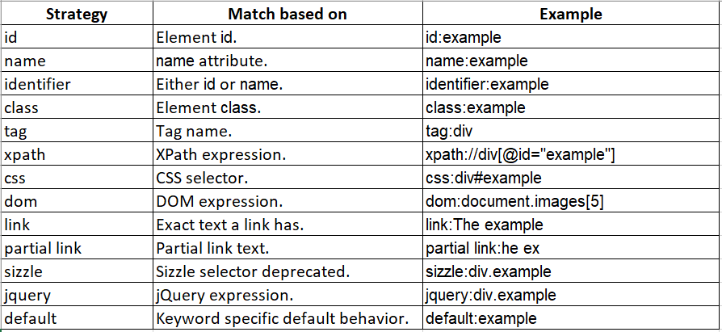
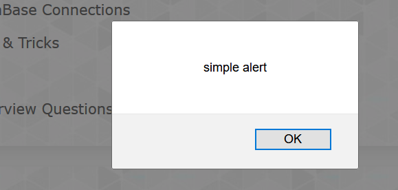
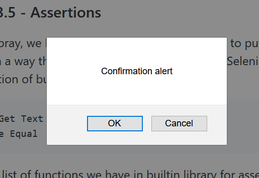

## Section 3


### Lecture 3.1 - Introduction to Selenium & SeleniumLibrary
Today, Selenium is the most popular browser automation tool. It is written entirely in Java. On the other hand, robot framework is Python based framework. Binding of selenium with robotframework is done with a library (written in python) and that is "selenium2Library" or "SeleniumLibrary".

Selenium2Library was the old library which was based on selenium 2. SeleniumLibrary is the new library which we would be using throughout our course.

To install SeleniumLibrary,

> pip install robotframework-seleniumlibrary


-------------------------------------------------------------

### Lecture 3.2 - Object Identification techniques

SeleniumLibrary supports finding elements based on different strategies such as the element id, XPath expressions, or CSS selectors. The strategy can either be explicitly specified with a prefix or the strategy can be implicit.




-------------------------------------------------------------

### Lecture 3.3 - Operations on web elements

**Launch Browsers**

The very first step is to download the drivers for Firefox, Chrome, IE or any browser which you want to automate and selenium supports. Download it from http://www.seleniumhq.org . After downloading, extract it and put the driver (chromedriver, geckodriver or iedriver) in C:/Python. You can actually keep these anywhere but that folder should be in environment variable "PATH", so that selenium can find it.

```
*** Settings ***
Library           SeleniumLibrary

*** Test Cases ***
TC1 - Launch Chrome
    Open Browser    https://www.youtube.com/c/xtremeexcel    chrome

TC2 - Launch Firefox
    Open Browser    https://www.youtube.com/c/xtremeexcel    firefox

TC3 - Launch Internet Explorer
    Open Browser    https://www.youtube.com/c/xtremeexcel    ie
```


**Interacting with web elements**
```
*** Settings ***
Library           SeleniumLibrary

*** Test Cases ***
TC1 - Clicking a link
    Open Browser    https://www.amazon.in    chrome
    #Click Element function is used to perform click operation on web elements
    Click Element    //a[contains(text(),'Try Prime')]

TC2 - Writing in a textbox
     Open Browser    https://www.google.in    chrome
     #Writing in search text box
     Input Text    //input[@class='gLFyf gsfi']    Kamal Girdher
     #Click on Google Search button
     Click Element    //*[@id="tsf"]/div[2]/div[1]/div[3]/center/input[1]

TC3 - Selecting a radio button
    Open Browser    https://www.dyn-web.com/tutorials/forms/examples/pizza.php    chrome
    Click Element    //*[@id="pizzaForm"]/fieldset/p[1]/label[3]/input
    
TC4 - Selecting a checkbox
    Open Browser    https://www.dyn-web.com/tutorials/forms/examples/pizza.php    chrome
    Click Element    //*[@id="pizzaForm"]/fieldset/p[1]/label[3]/input
    
TC5 - Selecting from a dropdown
    Open Browser    http://khanabook.weebly.com/store/c1/Featured_Products.html    chrome
    Select From List By Label    //select[@id='input-263590537572862908']    10 - 18 yrs    
```


Below is the list of functions used for interactions with web elements:

```
Choose File
Clear Element Text
Click Button
Click Element
Click Element At Coordinates
Click Image
Click Link
Close All Browsers
Close Browser
Close Window
Cover Element
Double Click Element
Drag And Drop
Drag And Drop By Offset
Go Back
Go To
Input Password
Input Text
Input Text Into Alert
Maximize Browser Window
Mouse Down
Mouse Down On Image
Mouse Down On Link
Mouse Out
Mouse Over
Mouse Up
Open Browser
Open Context Menu
Press Key
Press Keys
Reload Page
Scroll Element Into View
Select Checkbox
Select Frame
Select Radio Button
Select Window
Set Focus To Element
Submit Form
Switch Browser
Switch Window
Unselect Checkbox
```

-------------------------------------------------------------

### Lecture 3.4 - Wait statements

In Selenium, Waits play important role in test execution. There are 3 types of waits in Selenium:

1. Implicit Wait
The implicit wait will ask webdriver to wait for certain amount of time before it throws "No Such Element Exception". The default setting is 0. Once we set the time, webdriver will wait for that time before throwing an exception.

2. Explicit Wait
The explicit wait is used to ask webdriver to wait for some conditions with max time limit, before throwing an "ElementNotVisibleException" exception. 

3. Fluent Wait
The fluent wait is used ask webdriver to wait for a condition as well as frequency by which we want to check the condition before throwing an "ElementNotVisibleException" exception.

In robotframework, we have these functions to apply waits.
```
Wait For Condition
Wait Until Element Contains
Wait Until Element Does Not Contain
Wait Until Element Is Enabled
Wait Until Element Is Not Visible
Wait Until Element Is Visible
Wait Until Location Contains
Wait Until Location Is
Wait Until Page Contains
Wait Until Page Contains Element
Wait Until Page Does Not Contain
Wait Until Page Does Not Contain Element
```

-------------------------------------------------------------

### Lecture 3.5 - Assertions

In builtin libray, we have lot of functions that are used to put assertions in one or other way. Now we can add assetion in our test in such a way that we use **Get Text** function from SeleniumLibrary and compare with Expected text using **Should Be Equal** function of builtin library.

```
${a}=	Get Text	//a[@id='fname']
Should be Equal    ${a}    Kamal
```

Here is the list of functions we have in builtin library for assertions/checkpoints.

```
Length Should Be
Should Be Empty
Should Be Equal
Should Be Equal As Integers
Should Be Equal As Numbers
Should Be Equal As Strings
Should Be True
Should Contain
Should Contain Any
Should Contain X Times
Should End With
Should Match
Should Match Regexp
Should Not Be Empty
Should Not Be Equal
Should Not Be Equal As Integers
Should Not Be Equal As Numbers
Should Not Be Equal As Strings
Should Not Be True
Should Not Contain
Should Not Contain Any
Should Not End With
Should Not Match
Should Not Match Regexp
Should Not Start With
Should Start With
Variable Should Exist
Variable Should Not Exist
```

Apart from these functions, **SeleniumLibrary** also gives some more functions which are very frequently used at one or other place while we write web based automated tests.

```
Alert Should Be Present
Alert Should Not Be Present
Checkbox Should Be Selected
Checkbox Should Not Be Selected
Element Should Be Disabled
Element Should Be Enabled
Element Should Be Focused
Element Should Be Visible
Element Should Contain
Element Should Not Be Visible
Element Should Not Contain
Element Text Should Be
Element Text Should Not Be
Frame Should Contain
List Selection Should Be
List Should Have No Selections
Location Should Be
Location Should Contain
Locator Should Match X Times
Page Should Contain
Page Should Contain Button
Page Should Contain Checkbox
Page Should Contain Element
Page Should Contain Image
Page Should Contain Link
Page Should Contain List
Page Should Contain Radio Button
Page Should Contain Textfield
Page Should Not Contain
Page Should Not Contain Button
Page Should Not Contain Checkbox
Page Should Not Contain Element
Page Should Not Contain Image
Page Should Not Contain Link
Page Should Not Contain List
Page Should Not Contain Radio Button
Page Should Not Contain Textfield
Radio Button Should Be Set To
Radio Button Should Not Be Selected
Table Cell Should Contain
Table Column Should Contain
Table Footer Should Contain
Table Header Should Contain
Table Row Should Contain
Table Should Contain
Textarea Should Contain
Textarea Value Should Be
Textfield Should Contain
Textfield Value Should Be
Title Should Be
```


-------------------------------------------------------------

### Lecture 3.6 - Switching to windows and popups

While working with web based application we generally see some other dialog or windows popping in as a result of some events on the page. These windows or dialogs are of 3 types:

```
Alerts
Popups
Browser Windows
```


**Alerts**
There are three types of alerts.

1. Simple alert



2. Confirmation alert



3. Prompt alert


Alerts - Handle Alerts
Popup - Switch Window
Browser - Switch Browser

