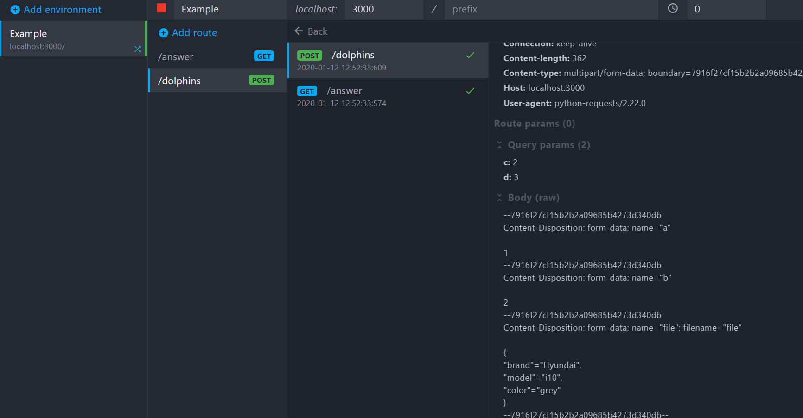
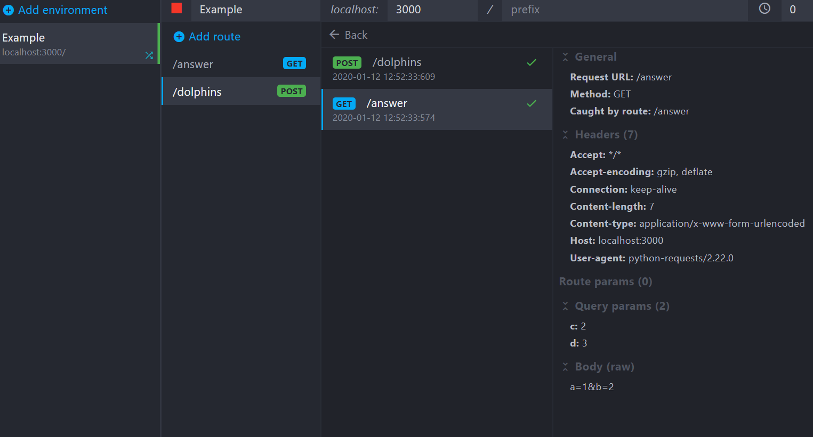

## Section 4 - RequestsLibrary for Robot framework


### Lecture 4.1 - Introduction to REST services and RequestsLibrary

REST stands for REpresentational State Transfer. REST uses HTTP Protocol and is web standards based architecture. Every component is called resource in REST terminology and a resource is accessed by a common interface using HTTP standard methods.

These are the four HTTP methods used in REST based architecture.

    1. GET

    2. POST

    3. PUT
	
    4. DELETE

Web services based on REST Architecture are known as RESTful web services. These webservices uses HTTP methods to implement the concept of REST architecture. A RESTful web service usually defines a URI, Uniform Resource Identifier a service, provides resource representation such as JSON and set of HTTP Methods.

In robot framework, **RequestsLibrary** is a library which gives functions to access the web services using these HTTP methods. It can be installed via **pip**

```
pip install -U requests
pip install -U robotframework-requests
```


### Lecture 4.2 - Various HTTP request methods

These are the four HTTP methods used in REST based architecture.

    GET - Provides a read only access to a resource.

    POST - Used to create a new resource.

    PUT - Used to update a existing resource or create a new resource.
	
    DELETE - Used to remove a resource.


### Lecture 4.3 - Get request | REST API testing using Robot framework

**GET request**
```
** Settings ** 	  	  	  	 
Library 	RequestsLibrary 	  	  	 
** Test Cases ** 	  	  	  	 
TC1 - Get request	  	  	 
  	Create Session 	google 	http://www.google.com 	 
  	${response}= 	Get Request 	google 	/
  	Should Be Equal As Strings 	${response.status_code} 	200 	 
```

**GET request using proxy**
```
TC2 - Get request using outbound proxies	  	  	 
  	${proxies}= 	Create Dictionary 	http=http://acme.com:912 	https=http://acme.com:913
  	Create Session 	google 	http://www.google.com    proxies=${proxies}
  	${response}= 	Get Request 	google 	/
  	Should Be Equal As Strings 	${response.status_code} 	200
```


**GET request using cookies**
```  	
TC3 - Get request using cookies	  	  	 
  	${cookies}= 	Create Dictionary 	cookie1=111 	cookie2=222
  	Create Session 	google 	http://www.google.com    cookies=${cookies}
  	${response}= 	Get Request 	google 	/
  	Should Be Equal As Strings 	${response.status_code} 	200
```  	


### Lecture 4.4 - Post request | REST API testing using Robot framework
**POST**
```
TC4 - Post request
    Create Session  uri  http://localhost:3000
  	${data}= 	Create Dictionary 	a=1    b=2
  	${params}= 	Create Dictionary 	c=2    d=3
    ${file_data}=  Get Binary File  ${CURDIR}${/}car.json
    &{files}=  Create Dictionary  file=${file_data}
    ${resp}=  Post Request  uri  /dolphins  files=${files}    data=${data}    params=${params}    
    Log    ${resp}
    Should Be Equal As Strings  ${resp.status_code}  200
```

**Visualising difference b/w GET and POST**
```
** Settings ** 	  	  	  	 
Library    RequestsLibrary
Library    OperatingSystem

** Test Cases ** 	  	  	  	 
 	
TC4 - Post request
    Create Session  uri  http://localhost:3000
  	${data}= 	Create Dictionary 	a=1    b=2
  	${params}= 	Create Dictionary 	c=2    d=3
    ${file_data}=  Get Binary File  ${CURDIR}${/}car.json
    &{files}=  Create Dictionary  file=${file_data}
    ${resp}=  Post Request  uri  /dolphins  files=${files}    data=${data}    params=${params}    
    Log    ${resp}
    Should Be Equal As Strings  ${resp.status_code}  200

TC5 - Get request with data and params
	Create Session 	uri 	http://localhost:3000
    ${data}= 	Create Dictionary 	a=1    b=2
  	${params}= 	Create Dictionary 	c=2    d=3 	 
  	${response}= 	Get Request 	uri 	/answer    data=${data}    params=${params}
  	Should Be Equal As Strings 	${response.status_code} 	200
```

**Logs for 'TC4 - Post request' on MOCKOON**


You can see that data and file goes in the form of form data and not as url query string.


**Logs for 'TC5 - Get request with data and params' on MOCKOON**



You can see that body of request goes in the form of query string parameters(URL).


### Lecture 4.5 - Put request | REST API testing using Robot framework


### Lecture 4.6 - Delete request | REST API testing using Robot framework


**PUT**


**DELETE**

### Lecture 4.3 - Headers and params

### Lecture 4.4 - Assertions